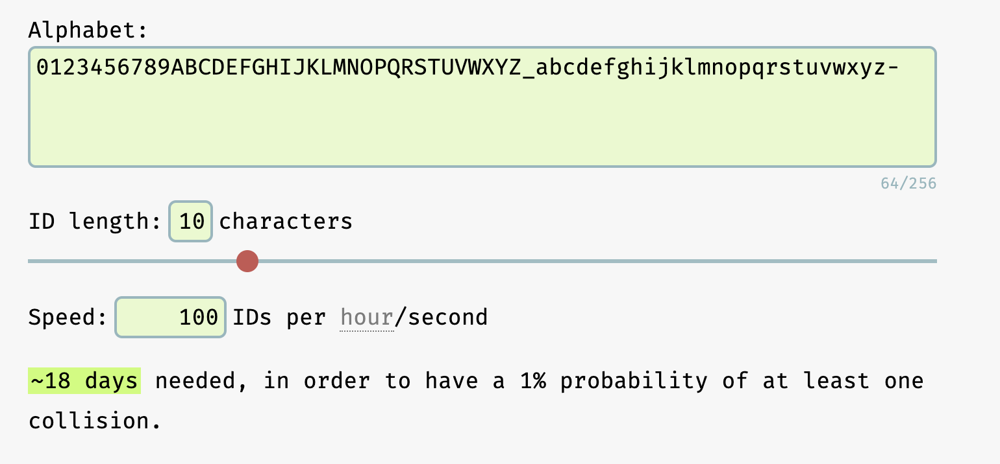

## Description

Framework: [Nest](https://github.com/nestjs/nest) TypeScript 

Service that powers a token generator system using NodeJs, Redis and
Docker.

## Running the app

```bash
# install
$ npm install
# development
$ npm run start
# watch mode
$ npm run start:dev
# production mode
$ npm run start:prod
```

## Test

```bash
# unit tests
$ npm run test
# test coverage
$ npm run test:cov
```
## Assumption
Tokens don't have a pool or user mapping

## Estimates
```
Assumptions => Read heavy system, 10:1 read/write

# Traffic estimates
Let's say we get write load of 100 tokens/sec
1  day => 24*60*60*10 => 8.6M tokens
10 days =>  86M tokens generated

# Stoarge Estimates
We need to maintain 8.6M tokens 
Let's say each token takes 1kb => we need (8.6*10^6)kb => ~8.6GB
*** so it's important to keep our token size minimal ***

#Bandwidth Estimates
For token generation => 100 req/sec (each req being 1kb) => 100kb/sec 
For token check and redemption => 10 * 100 req/sec (each being 1kb atleaset, token size) => 1Mb/sec 
```
## APIs
```
generate(count) => will assume that either it's an internal api to be called by our system 
 or exposed via api_dev_key, so no check for DDoS/xhr attacks 
check(token) => high availability
redeem(token) => high consistency
```

## DB
```
What should be the length of token?
If we assume a base64 encoding to generate tokens, 
a 6letter long token would result in 64^6 possible values => 68B possible tokens

However we will use NanoId, which has 21symbols only => 21^6 =>  85M possible tokens 
This closely covers the range of 86M tokens generated per 10 days
*** So for 10days we can avoid token collisions in given set ***
 
Token DB size => 
Let's say we need 1 byte to store 1 NanoId char
 6(1 byte) * 85M (# of tokens) => 510 Mb
```
 
## Points of Failure
```
// todo : Optimistic locking via watch, exec // edge case when 2 requests are racing to redeem same token
// check : does it matter if we re-redeem a redeemed token?
If token generation system is single instance
Single point of cache (scale to distributed cache)
Keep generate and check/redeem in seperate micro services as they will have different b/w scaling requirements (or lambdas)
cleanup crons
alert/monitoring checks
logging
```

[Nano ID Estimations](https://zelark.github.io/nano-id-cc/) 



[](https://app.getpostman.com/run-collection/79b38a80c0da2610edf4?action=collection%2Fimport)

## Tolkien

